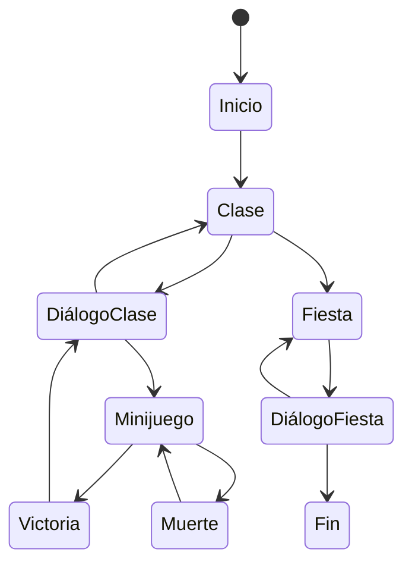
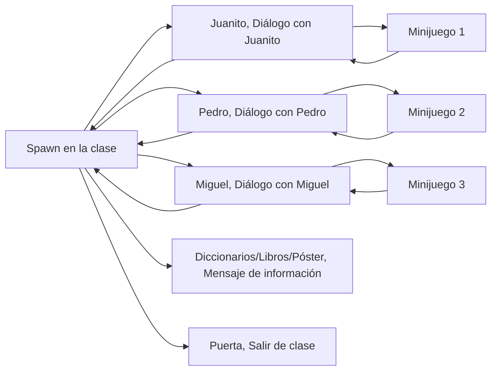
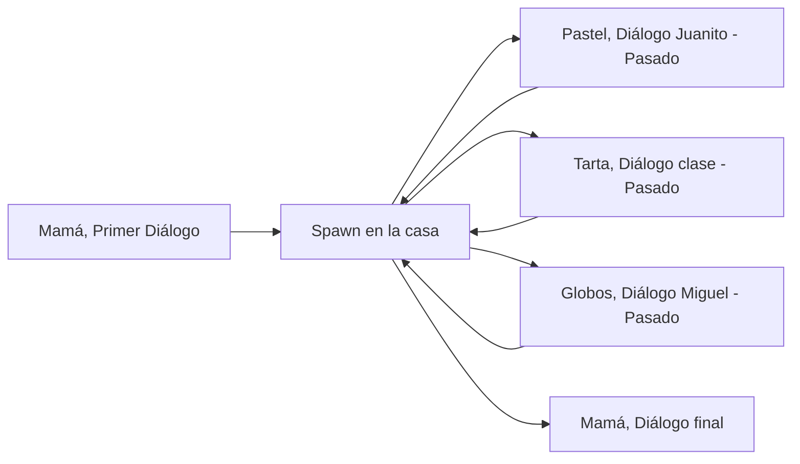
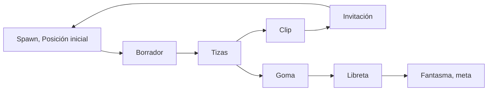
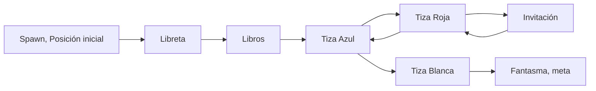
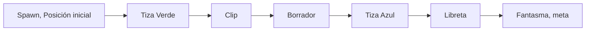
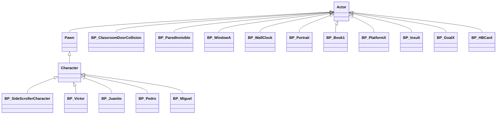
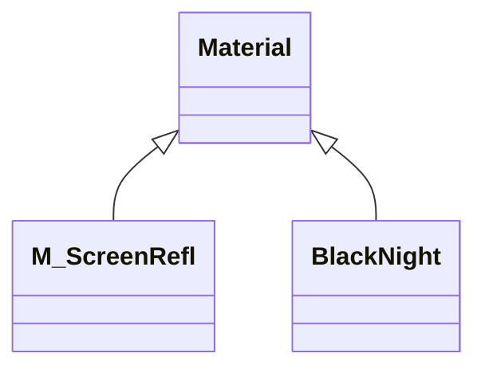
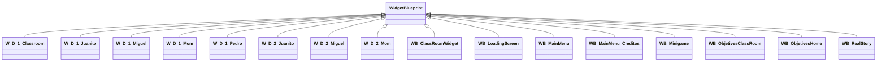

# DESARROLLO DE VIDEOJUEGOS - "VICHO RARO DEMO"
Esta práctica consiste en la práctica final de la asignatura de Diseño de Videojuegos para el Máster de Ingeniería Informática en la Universidad de Extremadura.

Para el desarrollo de esta práctica se ha utiliza la última versión ofrecida por el motor de Unreal Engine 5 siendo esta la versión 5.5.1.
Esta práctica se ha implementado partiendo de la plantilla de FirstPersonTemplate ofrecida por el motor de Unreal Engine 5.

"Vicho Raro Demo" surge como prototipo al Trabajo de Fin de Máster del estudiante Jesús Santos Fernández. Este proyecto consiste en el desarrollo de un videojuego como herramienta docente para concienciar y combatir el acoso escolar en las aulas de tercer ciclo de la educación primaria española.
Los avances de este proyecto se pueden seguir a través de las diferentes redes sociales del estudiante enlazadas en a través de <a href="https://linktr.ee/vichoraro"> este link</a>.

## Instalación y uso
Para hacer uso de este proyecto, por limitación del tamaño permitido por GitHub, todo el material adicional necesario a los recursos subidos en este repositorio se encuentran disponibles a través de la carpeta que se encuentra disponible a través de <a href="https://drive.google.com/drive/folders/1C3Ct_3gzNXF72ZuOEt142ZIjtlSwBu56?usp=sharing">este enlace</a>. El contenido debe descomprimirse y pegarse en la carpeta "Content" del proyecto.

## Preproducción
Para el desarrollo de este videojuego debíamos partir de una idea inicial a partir de la cual obtener los elementos claves que se querían incluir en el vídeojuego.

Como ya se ha comentado, este videojuego parte de la motivación por desarrollar un proyecto que intente concienciar sobre el acoso escolar en las aulas. Por ello, se parte de a historia de Pablo Sanchis Serrano para desarrollar una narrativa basada en esta. Es por ello que se piensa en el desarrollo de un videojuego de diálogo narrativo que intente contar esta historia.

Tras consultar con el profesorado y debatir la idea, se pone de manifiesto la existencia de ciertos minijuegos que se desarrollen a lo largo de la historia dado que un videojuego unicamente narrativo puede perder la atención de aquellos alumnos a los que no les guste la lectura.

Es por ello que, finalmente, se incluyen los siguientes elementos claves para el desarrollo del juego:

- El mundo se divide en **dos escenarios** principales. Uno estará basado en **un aula** de colegio. El otro estará basado en **una fiesta de cumpleaños**. Se pondrá especial immportancia en los detalles de decoración para hacer entender en qué tipo de entorno se encuentra el jugador. Es decir, el escenario de la clase debe parecer una clase y el escenario de la fiesta de cumpleaños debe parecer una celebración de cumpleaños en casa.
- Debe existir algún tipo de interación para pasar del escenario de la clase a la casa donde se estará celebrando el cumpleaños.
- Deben exisistir un diálogo con estilo de **novela visula** en la que algún personaje se muestre con un cuadro de diálogo que refleje las palabras de dicho personaje.
- Se integrarán **minijuegos de plataformas** que se desarrollarán a lo largo de la historia para dar cierto dinamismo a la jugabilidad de este videojuego. Estos minijuegos contarán con **un punto de partida**, **una meta a la que llegar** y **enemigos** que harán que el jugador regrese al punto de partida si es tocado por estos.
- En el mapa de **la clase** se encontrarán algunos **estudiantes**. Al interactuar con estos **se abrirá el diálogo** para invitarlos a la fiesta de cumpleaños. Será esta invitación la que desencadenará el evento del **minijuego**.
- En el mapa de **la fiesta de cumpleaños** se encontrará ciertos elementoss de fiesta. Al interactar con estos **se abirá el diálogo** de recuuerdos pasados en los que reflejarán que el alumno está siendo víctima de acoso escolar. Además, el entorno debe reflejar **el paso del tiempo** cuando se completan estos diálogos.

## Diseño
El diseño tiene las siguientes secciones:
- [Diseño preliminar](#diseño-preliminar)
  - [Escenario clase](#escenario-clase)
  - [Escenario fiesta](#escenario-fiesta)
  - [Escenario minijuego](#escenario-minijuego)
  - [Interfaz diálogo clase](#interfaz-diálogo-clase)
  - [Interfaz diálogo fiesta](#interfaz-diálogo-fiesta)
- [Estética](#estética)
  - [Gráficos](#gráficos)
  - [Sonidos](#sonidos)
    - [Efectos de sonido](#efectos-de-sonido)
    - [Música](#música)
- [Dinámica](#dinámica)
  - [Objetivo](#objetivo)
    - [Objetivos clase](#objetivos-clase)
    - [Objetivos minijuego](#objetivos-minijuego)
    - [Objetivos fiesta](#objetivos-fiesta)
  - [Castigo](#castigo)

### Diseño preliminar
A continuación, se muestra el diseño inicial de los diferentes mapas e interfaces del juego.

#### Escenario clase

#### Escenario fiesta

#### Escenario minijuego

#### Interfaz diálogo clase

#### Interfaz diálogo fiesta

### Estética
Como bien se ha comentado en puntos anteriores, se va a poner especial enfásis en la estética de los mapas del aula del colegio y de la fiesta de cumpleaños.

Para el **aula del colegio** se utilizarán, a parte de recursos habituales como pupitres, perchas, libros y pizarras, decoraciones en las paredes. Es habitual ver en los centros educativos, gran infinidad de dibujos, murales y pósters pegados en las paredes dotando de vida las aulas y los entornos de alrededor. También se cree recomendable incluir un pasillo, para dotar de mayor espacio y hacer ver que es un edificio grande. Se utilizará un paisaje falso mediante imágenes para mostrar por las ventanas.

Para la **fiesta de cumpleaños** se utilizará elementos decorativos para diseñar la casa y a esta decoración de interior se le agregarán elementos de una fiesta de cumpleaños como tartas, bocadillos, patatas fritas y globos. A su vez, como se ha indicado en el apartado anterior, se debe reflejar el paso del tiempo por lo que se deberá contar con elementos de ventanas que iluminen o no la instancia para reflejar este cambio de horas.

A su vez, para la **interfaz de usuario** se quiere recalcar que es un trabajo educativo y que tiene gran importancia el ámbito escolar en él por lo que los botones y demás elementos se reflejarán con herramientas dentro del entorno escolar como pizarras, libretas, notas, etc. Para la tipografía, se utilizarán aquellas con un estilo de escritura a mano o de tiza.

Se intentará dar dinamismo a través de los sonidos. Por ello se incluirán elementos sonoros como música o efectos que se adecúen a las escenas mostradas.

#### Gráficos
Para los elementos gráficos se han utilizado diferentes fuentes para conseguir así la estética indicada en el apartado anterior.

Los **assets** que dan lugar y forma a los diferentes mapas en los que se desarrolla nuestro videojuego se han utilizado fuentes de descarga gratuitas como son <a href="https://www.fab.com/">FAB</a> y  <a href="https://www.turbosquid.com/">TurboSquid</a>. 

Además, para los recursos de **texturas e imágenes** se utilizaron otras fuentes de descargas de elementos PNG y JPG como son <a href="https://www.pngegg.com/">PNGEgg</a>, <a href="https://es.pngtree.com/">PNGTree</a> y <a href="https://www.freepik.es/">Freepick</a> así como búsquedas directas en <a href="https://www.google.com/imghp">Google Imágenes</a>. Algunas de estas imágenes eran editadas posteriormente mediante el uso de la herramienta online <a href="">Photopea</a>.

Para los **sprites** de los personajes se utilizaron herramientas de creación de elementos mediante Inteligencia Artificial. Para esta se utilizó la herramienta <a href="https://openart.ai/home">OpenArt</a>.

Para finalizar, las **fuenes** utilizadas fueron obtenidas de la plataforma de <a href="https://www.dafont.com/es/">dafont.com</a> así como de <a href="https://fonts.google.com/">Google Fonts</a>.

Para comprobar los elementos y sus respectivas fuentes, se ofrece un listado de los recursos de terceros y las fuentes donde fueron descargados haciendo clic en <a href="https://docs.google.com/spreadsheets/d/105x5jadiWcKrHXqEFPZ0AK8x2Arj8u8JIHEGY2tgu6s/edit?usp=sharing">este enlace</a>.

#### Sonidos
Como se comentaba previamente, se va a hacer uso de música y recursos sonoros para mejorar la inmersión de nuestro videojuego.

Por un lado, el videojuego cuenta con música y con efectos de sonido. Todos los enlaces para conocer la obtención o creación de los elementos sonoros también se encuentran recogidos en el listado de recursos de tercero al que se puede acceder haciendo clic en <a href="https://docs.google.com/spreadsheets/d/105x5jadiWcKrHXqEFPZ0AK8x2Arj8u8JIHEGY2tgu6s/edit?usp=sharing">este enlace</a>.

##### Efectos de sonido
Los efectos de sonido han sido recogidos de fuentes gratuitas como son <a href="https://pixabay.com/sound-effects/">Pixabay</a>, <a href="https://freesound.org/">Freesound</a> y <a href="https://mixkit.co/free-sound-effects/">mixkit</a>.

##### Música
Toda la música incluida en el vidoejuego ha sido generada integramente por la herramienta de inteligencia artificial <a href="https://suno.com/">Suno</a> incluido el tema principal del videojuego.

Para la letra de este se le pasó el siguiente argumento: _Créame la letra para una canción corta infantil para niños de 10-12 años que hablen de la historia en la que invitas con toda la ilusión a tus compañeros a casa por tu fiesta de cumpleaños y acabas quedándote solo porque ninguno viene y recordando cómo eres víctima de acoso escolar._ A la herramienta de iinteligencia artificial <a href="https://chatgpt.com">ChatGPT</a>.

El resultado obtenido es el siguiente:

_**Verso 1**
Hoy es mi día, qué ilusión,
colgué globos en mi balcón.
Invité a todos, ¡qué felicidad!,
una fiesta llena de amistad._

_El pastel espera en la mesa,
mi sonrisa brilla con sorpresa.
Pero el reloj sigue sin parar,
y nadie, nadie quiere llegar._

_**Coro**
¿Por qué me siento tan pequeño aquí?
¿Por qué me cuesta tanto sonreír?
Quiero un abrazo, alguien que esté,
pero solo el silencio vino a mi fiesta esta vez._

_**Verso 2**
En el colegio dicen que soy raro,
que mi mundo es siempre muy callado.
No entienden mis juegos, mi forma de hablar,
y a veces me duele tanto aguantar._

_Intento ser fuerte, pero es difícil,
soñar despierto me hace invencible.
Aunque hoy mi corazón se rompió,
prometo que no estoy solo, no._

_**Coro**
¿Por qué me siento tan pequeño aquí?
¿Por qué me cuesta tanto sonreír?
Quiero un abrazo, alguien que esté,
pero solo el silencio vino a mi fiesta esta vez._

_**Puente**
Mamá dice que soy especial,
papá me recuerda que todo va a cambiar.
Hay alguien allá afuera que me entenderá,
y juntos crearemos una amistad._

_**Coro Final**
Aunque me sienta tan pequeño aquí,
en mi corazón sé que puedo seguir.
Construiré un mundo donde pueda estar,
con amigos de verdad, que sepan amar._

_**Outro**
Hoy aprendí que soy valiente,
y aunque duela, seguiré adelante.
Mi luz brillará, nadie la apagará,
porque sé que algún día todo cambiará._

### Dinámica
La dinámica del juego consiste en ir completando los diferentes objetivos que se marcan al jugador. Desde el mapa de la clase se pone como objetivos el hablar con los diferentes personajes. El diálogo de estos personajes desemboca en un minijuego cuya dinámica es la de ir desde el punto inicial al punto final recogiendo un objeto sin tocar los enemigos. A pesar de esto no hay límite de tiempo ni penalización al morir más allá de, en el minijuego, ser teletransportado al punto inicial.

A continuación se muestra un grafo de la dinámica del juego.

#### Objetivo
El objetivo del juego es el de **invitar a tus compañeros** a la fiesta de cumpleaños y acabar celebrándola.

No obstante, dentro de cada nivel se pueden observar diferentes objetivos.

##### Objetivos clase
En el mapa del aula, el objetivo principal es el de **invitar uno a uno** a tus compañeros de clase. Para lo cual deberás hablar con ellos en el orden correcto y terminar saliendo de clase para volver a casa una vez hayas invitado a todos tus compañeros.

##### Objetivos minijuego
Dentro de los diferentes minijuegos, el objetivo principal es el de **recoger la invitación** y acabar llevándosela al fantasma de fin de nivel (meta) sin chocar con los insultos (proyectiles) que lanzan los enemigos.
Estos niveles representan una metáfora de que al invitar a los fantasmas se está enfrentando a sus miedos.

##### Objetivos fiesta
En el mapa de la casa, donde se celebra la **fiesta de cumpleaños** el objetivo es el de revisar los diferentes elementos que hay decorando la fiesta y así descubrir escenas del pasado del protagonista.

#### Castigo
En relación al objetivo principal no existe un castigo por fallar al completar las misiones. De hecho, al ser escenas de diálogo no existe posibilidad de fallo o equivocación.

Dentro de los minijuegos sí que existe castigo por colisionar con los proyectiles enemigos. En este caso se devuelve al personaje a la posición de inicio del nivel desde donde deberá volver a intentarlo.

## Contenido
A continuación se listan los elementos más relevantes del videojuego. Para ello se van a hacer distinción entre los diferentes elementos en función de los mapas donde puedan encontrarse.

_Nota: No se van a incluir los blueprints desarrollados para crear elementos de teceros descargados los cuales venían separados en piezas y se debieron juntar en un único blueprint._

### Contenido_clase
#### Puertas
Son los elementos de interacción que vinculan la escena del mapa del aula, con la escena del mapa de la fiesta. Esto lo realiza una vez se han cumplido los tres objetivos (invitar los tres personajes). La interacción con este elemento desencadena el primer diálogo con la madre que, a su vez, da lugar a la escena de la fiesta de cumpleaños.

#### Personajes
Estos son los alumnos de la clase y compañeros del protagonista. El protagonista tiene como objetivos invitarlos a su cumpleaños. Los personajes tienen cada uno una personalidad diferente. Al interactuar con ellos desencadenan un diálogo propio que a su vez da lugar a una escena de minijuego que debe ser completado para avanzar en la historia.

#### Objetos curiosos
Repartidos por el mapa hay zonas en forma de TriggerBox las cuales se encargan de mostrar por pantalla un mensaje con información sobre elementos que se encuentran cerca. Por ejemplo: título de libros, un comentario cómico o un teléfono de apoyo contra el acoso escolar.

### Contenido_fiesta
#### Elementos interactuables
Toman la forma de TriggerBox dentro del mapa. A través de esto se desarrolla la interacción que da lugar a los diálogos que muestran escenas pasadas vividas por el protagonista de la historia para dar mayor profundidad a la narrativa. Estas escenas incluyen diversos personajes pero no presentan ningún minijuego que superar.

Estos elementos muestran un mensaje a través de la interfaz de usuario cuando se acerca a los elementos de los pastelitos, la tarta y los globos de "Happy Birthday" en el mapa de la fiesta de cumpleaños.

#### Paredes invisibles
Su nombre es autoexplicativo. Son elementos que se han visto necesarios para limitar el movimiento del jugador dentro de la escena de la fiesta. Estan formados por elementos de tipo Box escalados cuya visibilidad será desactivada dentro del blueprint del nivel.

#### Ventanas
Posicionadas tras los globos de "Happy Birthday" es uno de los elementos utilizados para mostrar el paso del tiempo. En sus blueprints se crearon una funciones para modificar la intensidad de la luz emitida intentando simular la luz natural. A su vez, tiene un panel con un material color azul marino oscuro bastante especular, el cual sirve para simular el reflejo de la luz por el interior de una ventana cuando la calle está oscura. De esta forma, se pretende simular que va cayendo la tarde y acaba siendo de noche.

_El paso del tiempo se da cada vez que el jugador interactúa con uno de los objetos y completa el diálogo asociado a ellos._

#### Reloj de pared
Es otro de los elementos que pretenden simular el paso del tiempo. Este actualiza su posición rotando 30 grados cada vez que pasa el tiempo. De esta forma va marcando diferentes horas indicando que el tiempo ha pasado mientras el protagonista recordaba esos momentos.

_El paso del tiempo se da cada vez que el jugador interactúa con uno de los objetos y completa el diálogo asociado a ellos._

### Minijuegos

#### Plataformas [1-7]
Son plataformas sobre las cual deberá saltar el jugador hasta llegar al objetivo.

#### Plataforma 8
Es una plataforma como las anteriores con la peculiaridad que estas se mueven de forma lineal. Al chocar contra un elemento de pared invisible para plataforma móvil, cambian su el sentido de su dirección. De esta forma, se crea un movimiento lateral de izquierda a derecha y viceversa.

#### Pared para rebotar
Es un tipo de pared invisible especial la cual toma como variable dos plataformas 8. Al colisionar con estas cambia el sentido de sus direcciones.

#### Tarjeta de invitación
Se trata del elemento recogible que debe tomar el jugador para invitar al compañero a su cumpleaños. Esta tarjeta debe llevarla al fantasma que representa la meta del nivel. Cuanto este elemento es recogido se escucha unos arcordes que pertenecen a la melodía de "Cumpleaños Feliz".

#### Meta
Se trata del objetivo final del nivel de minijuego y toma la forma de un fantasma representando así el miedo del protagonista hacia sus compañeros de clase. El jugador deberá colisionar con este cuando haya conseguido la Tarjetta de invitación. 

#### Insulto
Son los proyectiles que debe esquivar el jugador cuando existan en el nivel. La colisión con estos reproduce un pitido de censura y llevan al jugador a la posición de inicio del minijuego.

### Interfaz de Usuario
#### Diálogos
Se representan mediante Widgets Blueprints y el diálogo es almacenado en Data Tables vinculadas a una estructura de datos que se define como:
- Enum de nombre de personajes
- Fondo del dialogo
- Sprite a la derecha
- Sprite a la izquierda
- Enum de propiedades (para indicar si está hablando un personaje u otro).
  
_Para indicar si un personaje habla o no, se juega con la opacidad del sprite que lo representa. También es posible no mostrar uno o ambos sprites_.

#### Objetivos
También se representan mediante Widgets Blueprints. Los objetivos son cadenas de textos predefinidas que cambian su opacidad cuando han sido completadas o cuando deben aparecer.

#### Pantallas de carga
Es un elemento de Widget Blueprint el cual intenta simular una pantalla de carga. Este se muestra cada vez que se inicia un nivel y sirve para impedir que el usuario pueda ver el nivel mientras carga la textura. Para indicar al jugador que el nivel está cargando y que no se ha quedado colgado el juego, se muestra una barra de progreso móvil y tres cadenas de texto con una animación de ir apareciendo y desapareciendo.

## Topología
A continuación, se muestra la topología de las diferentes zonas del videojuego.

### Mapa de Clase
El juego comienza en este nivel. Para superarlo debe ir hablando en orden con los compañeros de clase. Primero debe hablar con Juanito, completar su minijuego y terminar la conversación. Tras este debe hablar con Pedro, completar su minijuego y terminar la conversación. Por último debe hablar con Miguel, superar su minijuego y terminar la conversación. De esta forma podrá salir por la puerta, completando este nivel.

### Mapa de fiesta
Este mapa comienza con el diálogo con la madre. Tras esto apareces en la casa y puedes interactuar con los objetos de pastel, tarta y globos para desencadenar el diálogo con los diferentes personajes.

### Minijuego 1
En este primer mapa de minijuego debes ir saltando sobre las plataformas para agarrar la invitación de cumpleaños y entregarsela al fantasma.

### Minijuego 2
En este segundo mapa de minijuego debes ir saltando sobre las diferentes plataformas evitando ser golpeado por los proyectiles enemigos, para agarrar la invitación de cumpleaños y entregarsela al fantasma.

### Minijuego 3
En este tercer mapa de minijuego debes escalar con la ayuda de las plataformas móviles evitando ser golpeado por los proyectiles enemigos, para agarrar la invitación de cumpleaños y entregarsela al fantasma.

## Producción
Las tareas se fueron desarrollando poco a poco en función del tiempo disponible por el alumno. 
| Estado  |  Tarea  |  Fecha  |  
|:-:|:--|:-:|
| ✔ | Diseño: Mapa de pruebas | 23-12-2024 |
| ✔ | Diseño: Assets de la clase | 24-12-2024 |
| ✔ | Diseño: Mapa de la clase | 27-12-20214 |
| ✔ | Diseño: Mapa de la casa | 30-12-2024 |
| ✔ | Diseño: Decoración cumpleaños | 2-01-2025 |
| ✔ | Diseño: Sonido y música de la casa y la clase | 2-01-2025 |
| ✔ | Diseño: Diseño primer minijuego | 4-01-2025 |
| ✔ | Mecánima: Funcionamiento de minijuegos 1, 2 y 3 | 4-01-2025 |
| ✔ | Diseño: Personajes | 5-01-2025 |
| ✔ | Mecánica: Animaciones de los personajes | 5-01-2025 |
| ✔ | Diseño: Diálogos | 7-01-2025 |
| ✔ | Mecánica: Funcionamiento diálogo personaje 1 | 7-01-2025 |
| ✔ | Mecánica: Funcionamiento diálogo personajes 2 y 3 y madre | 8-01-2025 |
| ✔ | Mecánica: Conexión entre la clase y la casa | 8-01-2025 |
| ✔ | Mecánica: Funcionamiento diálogos de la casa | 9-01-2025 |
| ✔ | Diseño: Menú | 9-01-2025 |
| ✔ | Mecánica: Botones del menú | 9-01-2025 |
| ✔ | Mecánica: Lista de objetivos | 9-01-2025 |
| ✔ | Diseño: Mensaje de inicio de juego | 10-01-2025 |
| ✔ | Diseño: Pantalla de carga | 10-01-2025 |
| ✔ | Empaquetado | 10-01-2025 |

<b></b>
Como lista de mecánicas implementadas podría expresarse así:
- [x] Mecánica: Diálogos de los personajes
- [x] Mecánica: Mostrar diálogos letra a letra
- [x] Mecánica: Invitación de cumpleaños (minijuego)
- [x] Mecánica: Meta (minijuego)
- [x] Mecánica: Cambio de mapa (clase con casa)
- [x] Mecánica: Plataformas móviles (minijuego)
- [x] Mecánica: Insultos móviles (minijuego)
- [x] Mecánica: Ventanas temporales (paso del tiempo)
- [x] Mecánica: Reloj temporal (paso del tiempo)
- [x] Mecánica: Trofeo que da la victoria al jugador y muestra los créditos

<b></b>
Las **clases principales** que se han desarrollados son las siguientes:

<b></b>
Por problemas con los assets importados, en ocasiones ha sido necesario crear **materiales** a partir de las texturas obtenidas en las descargas de estos. No se toman como relevantes los materiales generados a través de imágenes para las decoraciones como los pósters o las fotografías. No obstante, se han creado algunos materiales como:

<b></b>
Por último, se han desarrollado una serie de **widgets** tanto para el menú, como para las transiciones de zona y los diálogos. Serían los documentados a continuación:

## Posproducción
Tras haber pulido el juego lo máximo posible y habiendo corregido todos los errores encontrados se ha empaquetado el juego. Este, a su vez, ha sido subido a la plataforma de itch.io desde donde podrá ser descargado de forma gratuita a través de [este enlace](https://jesus-santos.itch.io/vichoraro-demo).

Para complementarlo, como lo que se quiere es que este sirva como herramienta docente para tratar aspectos relacionados con el acoso escolar, aunques sea un prototipo, se ha creado una pequeña guía docente con algunas actividades para tratar estos temas a la cual se puede acceder a través de [este link](https://drive.google.com/file/d/16jMQHb-jsimUMNK_BrzBilsG9PDAPS2M/view?usp=drive_link).

Además, se pretende dar difusión de este prototipo para que a su vez sirva para dar difusión al Trabajo de Fin de Máster que se pretende realizar. Para ello, se está hablando de este prototipo a través de las redes sociales del alumno, a las cuales se pueden acceder a través de [este otro enlace de LinkTree](https://linktr.ee/vichoraro).

De igual forma, se intentará contactar con el programa [Conexión Extremadura](http://www.canalextremadura.es/programas/conexion-extremadura) de [Canal Extremadura](http://www.canalextremadura.es/) por si estarían dispuestos a darle difusión a este proyecto.

## Easter Eggs
Dentro del juego hay algunos pequeños easter eggs y referencias que seguramente pasen desapercibidos para la mayoría de jugadores. Aún así, los voy a listar aquí.

- Referencias a mis referentes principales: "Recuerda Aquella Vez" de Adam Silvera y Mike Lightwook.
- Referencias a nuestros referentes del proyecto: "Invisible" de Eloy Moreno (y su adaptación a la televisión por Paco Caballero e "Invisible" de R. J. Palacio.
- Referencia a mi yo de 12 años que decidió hacer de su lucha una motivación y me trajo hasta donde estoy hoy día.
- Referencia a quienes ayudaron a ese yo de 12 años y que me dieron un lugar donde sentirme seguro y querido.

No voy a decir dónde se encuentran estos easter-eggs por si alguien quiere entretenerse buscándolos. 

## Vídeo
Se ha pedido realizar un vídeo mostrando la funcionalidad del videojuego. Para acceder a este haga clic en [este enlace](https://youtu.be/rkXzWT0f0Pw).

## Licencia
Jesús Santos Fernández, autor de la documentación, código y recursos de este trabajo, concedo permiso permanente a los profesores de la Facultad de Informática de la Universidad Complutense de Madrid para utilizar este material, con sus comentarios y evaluaciones, con fines educativos o de investigación; ya sea para obtener datos agregados de forma anónima como para utilizarlo total o parcialmente reconociendo expresamente nuestra autoría.

Una vez superada con éxito la asignatura se prevee publicar todo en abierto (la documentación con licencia Creative Commons Attribution 4.0 International (CC BY 4.0) y el código con licencia GNU Lesser General Public License 3.0).

## Referencias
- Conectado
- El Viaje De Elisa
- School Of Empathy
- De Fobos y Deimos
- Gylt
- Happy
- Arbax
- Invisible
- Wonder
- SunoAI
- ChatGPT
- Unreal Engine
- Udemy
- Freesound
- DatFont
- GoogleFonts
- Photopea
- Freepics
- Canva
- itch.io
- LinkTree
- Conexión Extremadura
- Canal Extremadura
